# 🏗️ EhTrace Architecture

> **Deep dive into the technical architecture of EhTrace's high-performance binary tracing framework**

---

## 🎯 Executive Overview

EhTrace is built on a foundation of Windows exception handling mechanisms, enabling transparent binary instrumentation without code modification. The architecture leverages VEH (Vectored Exception Handling), single-step debugging, and shared memory IPC to achieve unprecedented tracing performance.

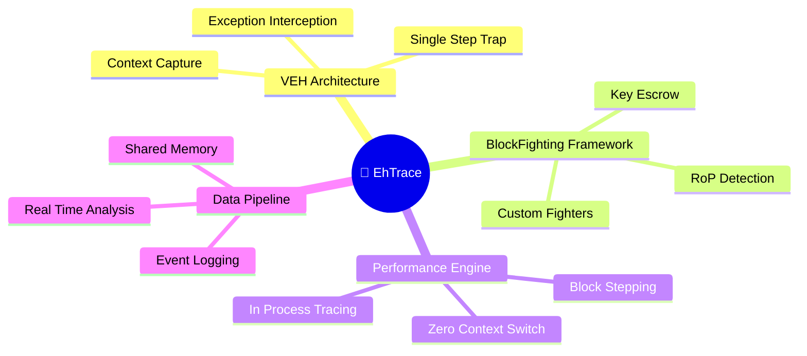

---

## 🔄 Execution Flow

### High-Level Pipeline

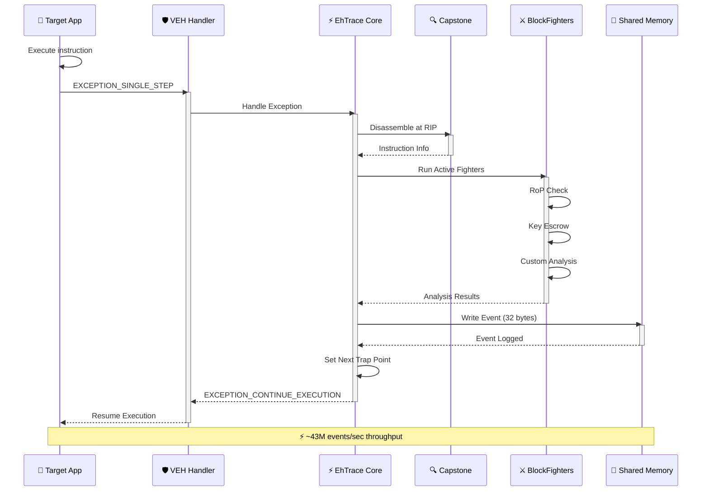

### Detailed Exception Flow

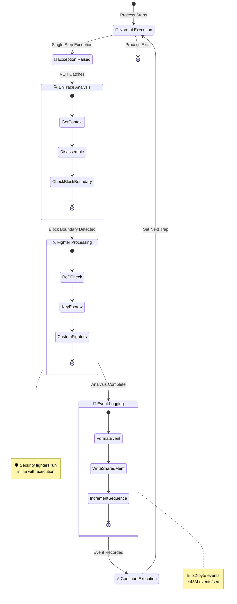

---

## 🧩 Component Architecture

### Core Module Interaction

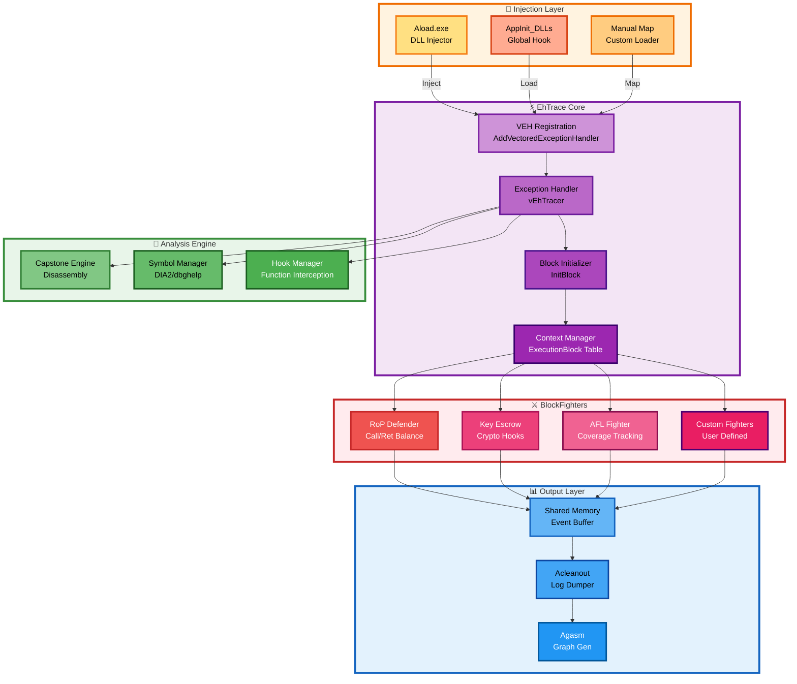

---

## 💾 Data Structures

### ExecutionBlock Context

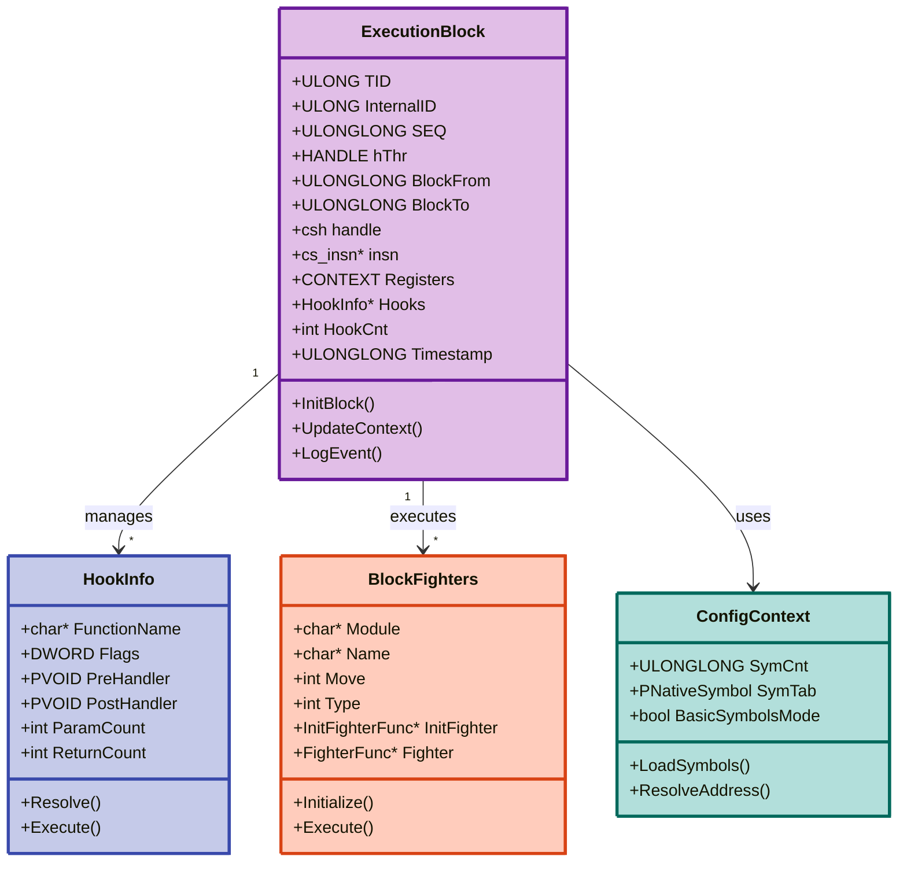

### Event Format (32 bytes)

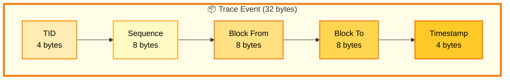

---

## ⚔️ BlockFighters Framework

### Fighter Execution Model

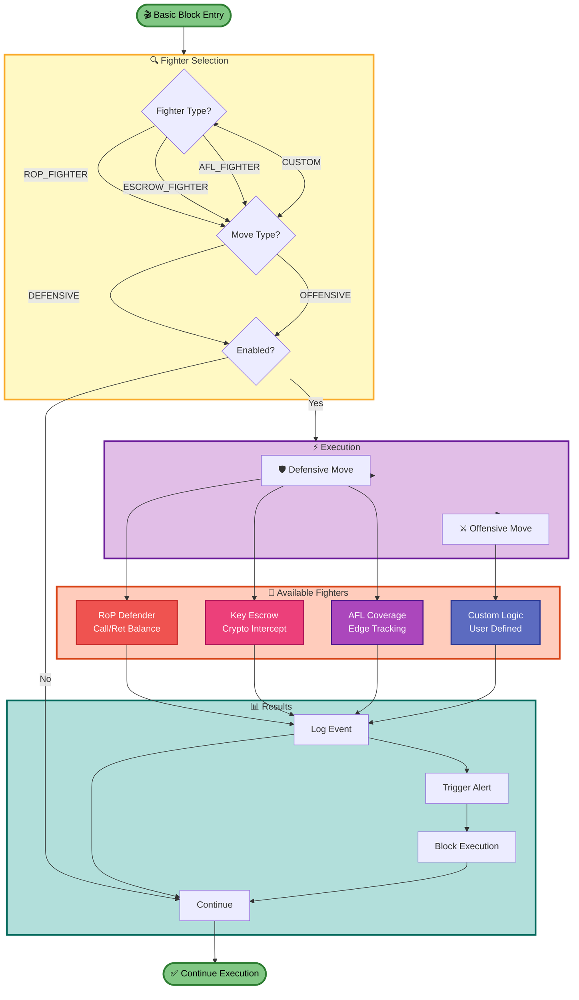

### RoP Defender Logic

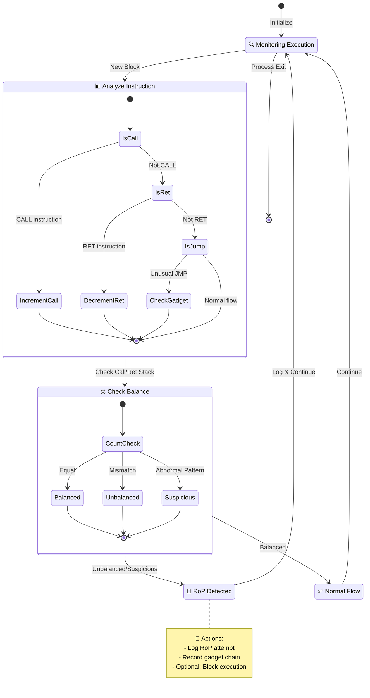

---

## 🔄 Memory Architecture

### Shared Memory Layout

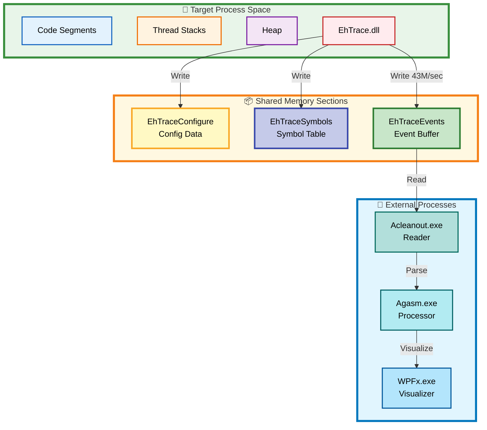

### Buffer Management

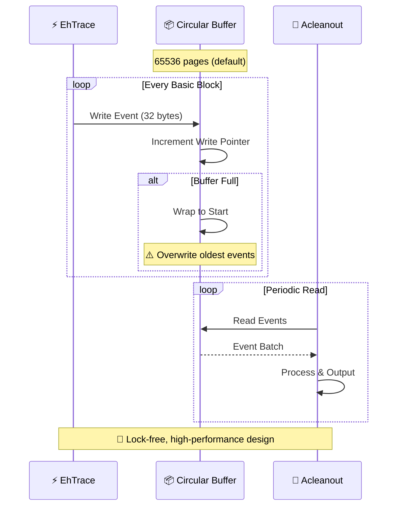

---

## 🔌 Hook Architecture

### Function Hook Pipeline

```mermaid
flowchart LR
    subgraph Detection["🔍 Hook Detection"]
        Resolve[Symbol Resolution]
        Match[Name Matching]
        Config[Hook Config]
        
        style Resolve fill:#ffe0b2,stroke:#e65100,stroke-width:2px,color:#000
        style Match fill:#ffccbc,stroke:#d84315,stroke-width:2px,color:#000
        style Config fill:#ffab91,stroke:#bf360c,stroke-width:2px,color:#000
    end
    
    subgraph Interception["⚡ Interception"]
        Pre[Pre-Handler]
        Exec[Original Function]
        Post[Post-Handler]
        
        style Pre fill:#c5cae9,stroke:#3949ab,stroke-width:2px,color:#000
        style Exec fill:#9fa8da,stroke:#283593,stroke-width:2px,color:#000
        style Post fill:#7986cb,stroke:#1a237e,stroke-width:2px,color:#fff
    end
    
    subgraph Processing["📊 Processing"]
        Log[Log Parameters]
        Escrow[Escrow Keys]
        Analyze[Analyze Behavior]
        
        style Log fill:#b2dfdb,stroke:#00695c,stroke-width:2px,color:#000
        style Escrow fill:#80cbc4,stroke:#004d40,stroke-width:2px,color:#000
        style Analyze fill:#4db6ac,stroke:#00251a,stroke-width:2px,color:#fff
    end
    
    Resolve --> Match
    Match --> Config
    Config --> Pre
    Pre --> Exec
    Exec --> Post
    Post --> Log
    Log --> Escrow
    Escrow --> Analyze
    
    style Detection fill:#fff3e0,stroke:#ef6c00,stroke-width:3px
    style Interception fill:#e8eaf6,stroke:#3949ab,stroke-width:3px
    style Processing fill:#e0f2f1,stroke:#00695c,stroke-width:3px
```

---

## 🎨 Visualization Pipeline

### Graph Generation Flow

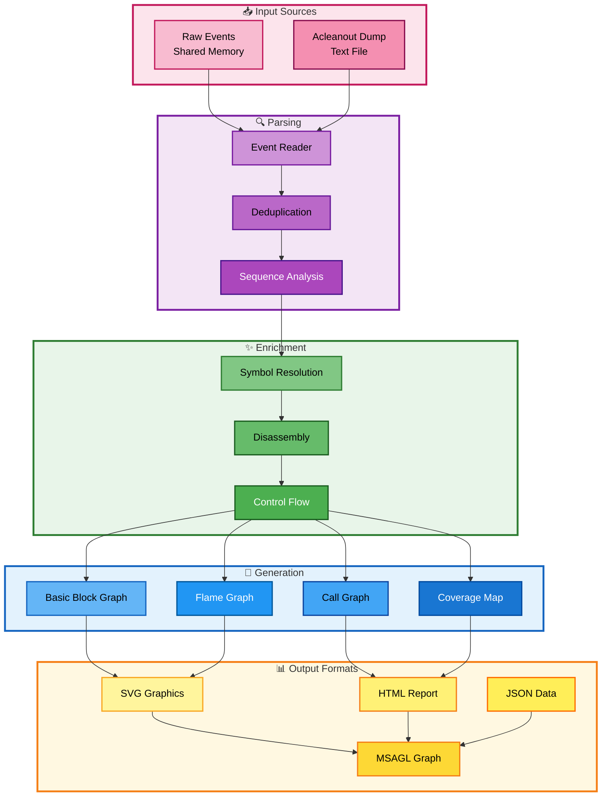

---

## 🚀 Performance Optimization

### Critical Path Analysis

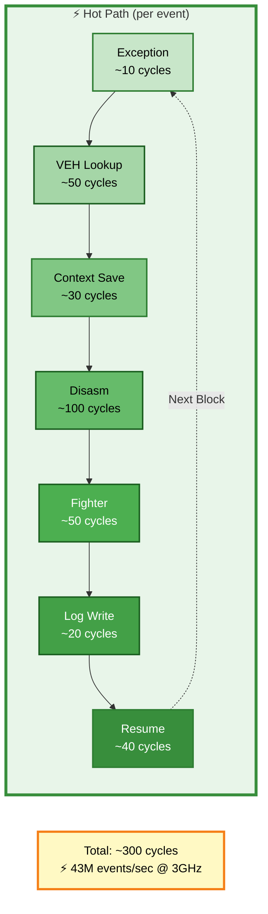

### Optimization Techniques

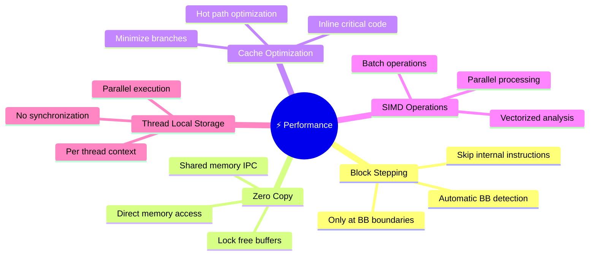

---

## 🔒 Security Considerations

### Threat Model

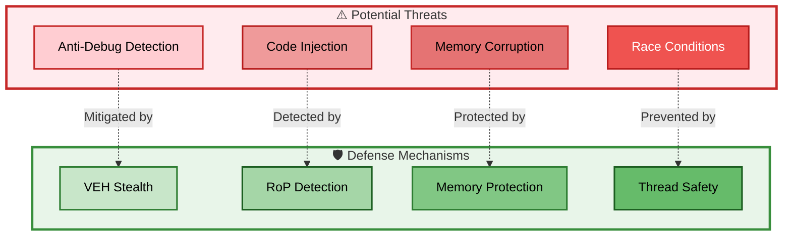

---

## 📚 References

### Key Technologies

| Technology | Purpose | Link |
|------------|---------|------|
| **Capstone** | Disassembly Engine | [capstone-engine.org](http://www.capstone-engine.org/) |
| **MSAGL** | Graph Visualization | [Microsoft Research](https://www.microsoft.com/en-us/research/project/microsoft-automatic-graph-layout/) |
| **DIA2** | Symbol Processing | [MSDN Documentation](https://docs.microsoft.com/en-us/visualstudio/debugger/debug-interface-access/) |
| **VEH** | Exception Handling | [Windows Documentation](https://docs.microsoft.com/en-us/windows/win32/debug/vectored-exception-handling) |

---

> 🎯 **EhTrace**: Where performance meets precision in binary instrumentation

