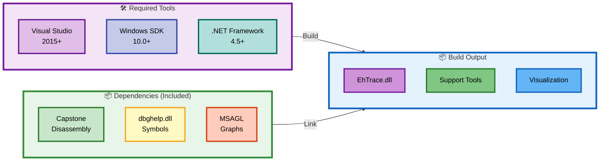
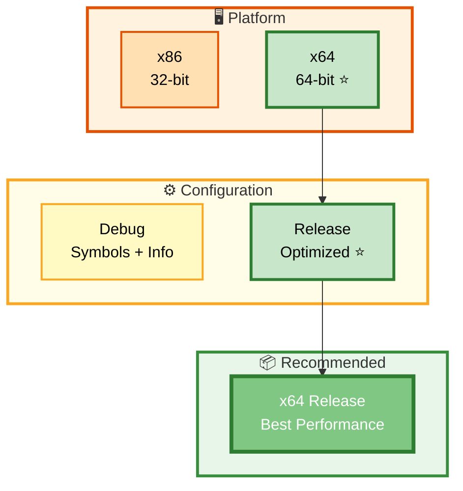

# 🏗️ Building EhTrace

> **Complete guide to building EhTrace and its ecosystem from source**

---

## 📋 Prerequisites

### Build Pipeline Overview



This guide provides detailed instructions for building EhTrace and its associated components.

### Required Software

1. **Visual Studio 2015 or later**
   - C++ Desktop Development workload
   - Windows SDK (10.0 or later recommended)
   - Platform Toolset v140 or later

2. **.NET Framework**
   - .NET Framework 4.5 or later (for visualization tools)
   - WPF components

3. **Git** (for cloning the repository)

### Dependencies (Included)

The following dependencies are included in the `support/` directory:

- **Capstone** - Disassembly engine (capstone_dbg.lib, capstone_rel.lib)
- **dbghelp.dll** - Symbol resolution
- **symsrv.dll** - Symbol server support
- **MSAGL** - Microsoft Automatic Graph Layout libraries

---

## 🔨 Build Configuration

### Configuration Matrix



### Platform Options

- **x86** - 32-bit builds
- **x64** - 64-bit builds ⭐ **(recommended)**

### Configuration Options

- **Debug** - Debug build with symbols and debugging information
- **Release** - Optimized release build ⭐ **(recommended)**

---

## 🎯 Building from Visual Studio

### Method 1: Using Visual Studio IDE

1. Open Visual Studio
2. File → Open → Project/Solution
3. Navigate to the EhTrace directory
4. Open `EhTrace.sln`
5. Select your desired configuration (Debug/Release) from the dropdown
6. Select your desired platform (x86/x64) from the dropdown
7. Build → Build Solution (or press Ctrl+Shift+B)

### Method 2: Using Visual Studio Developer Command Prompt

```batch
# Navigate to the EhTrace directory
cd C:\path\to\EhTrace

# Build for x64 Release
msbuild EhTrace.sln /p:Configuration=Release /p:Platform=x64

# Build for x64 Debug
msbuild EhTrace.sln /p:Configuration=Debug /p:Platform=x64

# Build for x86 Release
msbuild EhTrace.sln /p:Configuration=Release /p:Platform=x86
```

## Building Individual Components

### Core EhTrace DLL

```batch
# Build only the main EhTrace project
msbuild EhTrace\EhTrace.vcxproj /p:Configuration=Release /p:Platform=x64
```

Output: `x64/Release/EhTrace.dll`

### Supporting Tools

#### Acleanout (Log Dumper)

```batch
msbuild prep\Acleanout\Acleanout.vcxproj /p:Configuration=Release /p:Platform=x64
```

Output: `prep/Acleanout/x64/Release/Acleanout.exe`

#### Agasm (Disassembly Tool)

```batch
msbuild prep\Agasm\Agasm.vcxproj /p:Configuration=Release /p:Platform=x64
```

Output: `prep/Agasm/x64/Release/Agasm.exe`

#### Aload (DLL Loader)

```batch
msbuild prep\Aload\Aload.vcxproj /p:Configuration=Release /p:Platform=x64
```

Output: `prep/Aload/x64/Release/Aload.exe`

#### AWinAFL (Fuzzing Instrumentation)

```batch
msbuild prep\AWinAFL\AWinAFL.vcxproj /p:Configuration=Release /p:Platform=x64
```

Output: `prep/AWinAFL/x64/Release/AWinAFL.dll`

### Visualization Tools

#### WPFx (Graph Viewer)

```batch
msbuild vis\WPFx\WPFx.csproj /p:Configuration=Release /p:Platform=AnyCPU
```

Output: `vis/WPFx/bin/Release/WPFx.exe`

## Build Options

### Preprocessor Definitions

The following preprocessor definitions can be used to customize the build:

- **ALIB_BUILD** - Build as a library instead of standalone DLL
- **NO_ROP_DEFENDER** - Disable ROP detection features
- **NO_KEY_ESCROW** - Disable key escrow features
- **ENABLE_LOGGING** - Enable verbose logging

To add custom definitions:

```batch
msbuild EhTrace\EhTrace.vcxproj /p:Configuration=Release /p:Platform=x64 /p:PreprocessorDefinitions="ENABLE_LOGGING"
```

## Output Locations

After building, binaries will be located in:

```
EhTrace/
├── x64/
│   ├── Debug/
│   │   ├── EhTrace.dll
│   │   ├── EhTrace.pdb
│   │   └── ...
│   └── Release/
│       ├── EhTrace.dll
│       └── ...
├── prep/
│   ├── Acleanout/x64/Release/Acleanout.exe
│   ├── Agasm/x64/Release/Agasm.exe
│   ├── Aload/x64/Release/Aload.exe
│   └── ...
└── vis/
    └── WPFx/bin/Release/WPFx.exe
```

## Common Build Issues

### Issue: "Cannot find dbghelp.lib"

**Solution**: The project uses dbghelp.dll at runtime (not link-time). Ensure the DLL is in the support directory or system path.

### Issue: "Cannot find capstone library"

**Solution**: Verify that `support/capstone_rel.lib` or `support/capstone_dbg.lib` exists. The project should automatically select the correct library based on configuration.

### Issue: "Missing Windows SDK"

**Solution**: Install the Windows SDK through Visual Studio Installer:
1. Open Visual Studio Installer
2. Modify your Visual Studio installation
3. Check "Windows 10 SDK" under Individual Components
4. Click Modify to install

### Issue: Platform toolset not found

**Solution**: 
1. Open the .vcxproj file in a text editor
2. Find the `<PlatformToolset>` element
3. Change it to match your installed toolset (e.g., v140, v141, v142, v143)
4. Save and rebuild

Alternatively, let Visual Studio retarget the solution:
1. Right-click on the solution in Solution Explorer
2. Select "Retarget Solution"
3. Choose your installed SDK and platform toolset

## Advanced Build Configurations

### Custom Fighter Configuration

To build with custom BlockFighters, modify the fighter list in `EhTrace/BlockFighters.cpp` before building.

### Static vs Dynamic Linking

By default, EhTrace uses dynamic linking. To change to static linking:

1. Open project properties
2. Navigate to C/C++ → Code Generation
3. Change Runtime Library to:
   - `/MT` for Release (Multi-threaded)
   - `/MTd` for Debug (Multi-threaded Debug)

### Optimization Settings

For maximum performance in Release builds:

1. Open project properties
2. C/C++ → Optimization
3. Set Optimization to "Maximize Speed (/O2)"
4. Enable "Whole Program Optimization"
5. Linker → Optimization → Enable "Link Time Code Generation"

## Testing the Build

After building, verify the installation:

```batch
# Check EhTrace.dll exports (if built with exports)
dumpbin /EXPORTS x64\Release\EhTrace.dll

# Test Aload
prep\Aload\x64\Release\Aload.exe notepad.exe x64\Release\EhTrace.dll

# Test Acleanout
prep\Acleanout\x64\Release\Acleanout.exe
```

## Continuous Integration

For automated builds, use the MSBuild command line:

```batch
@echo off
set MSBUILD="C:\Program Files\Microsoft Visual Studio\2022\Community\MSBuild\Current\Bin\MSBuild.exe"

%MSBUILD% EhTrace.sln /p:Configuration=Release /p:Platform=x64 /m
if errorlevel 1 exit /b 1

echo Build successful!
```

## Next Steps

After building, see [USAGE.md](USAGE.md) for instructions on using EhTrace to trace and analyze binaries.
