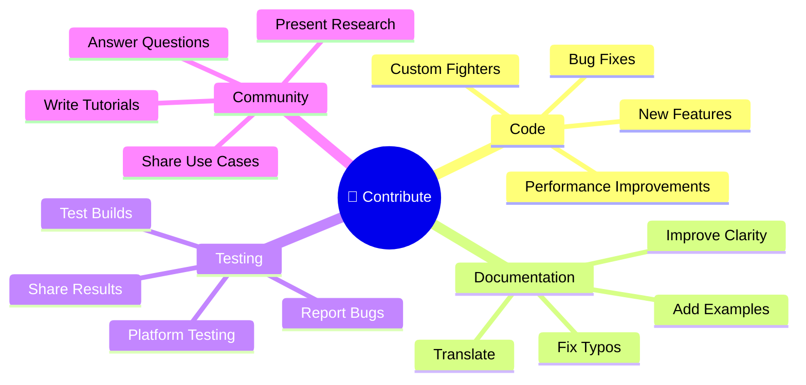
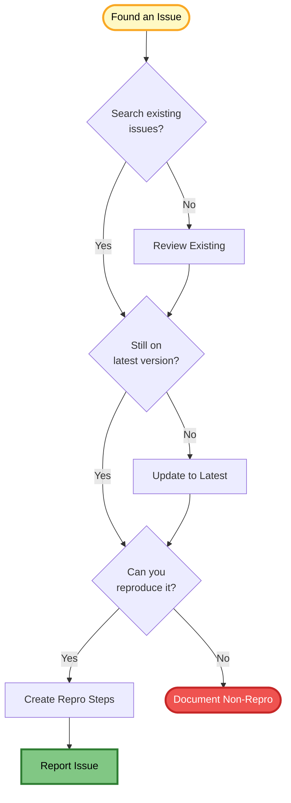
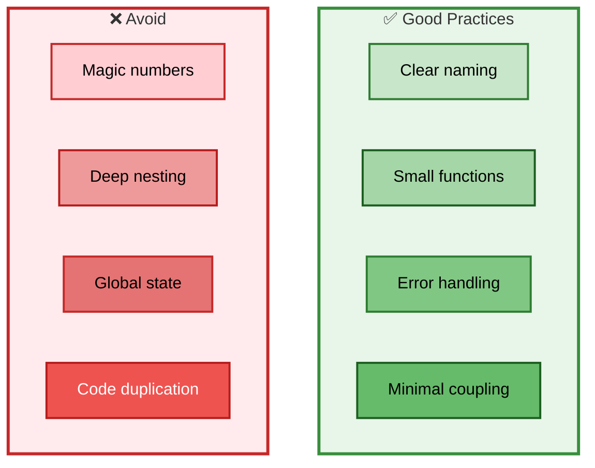
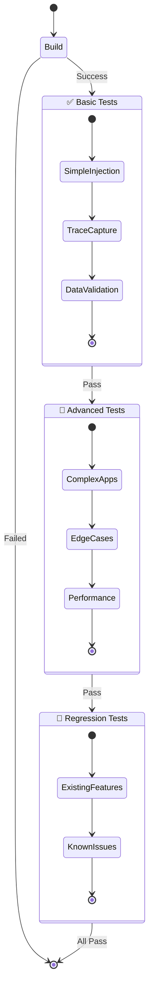
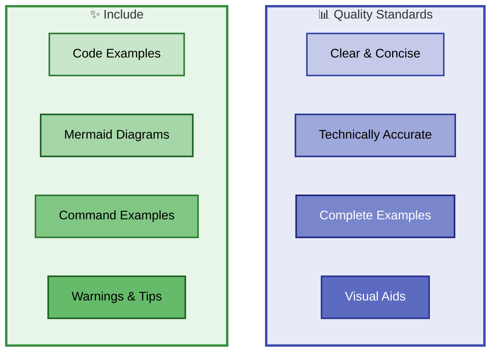
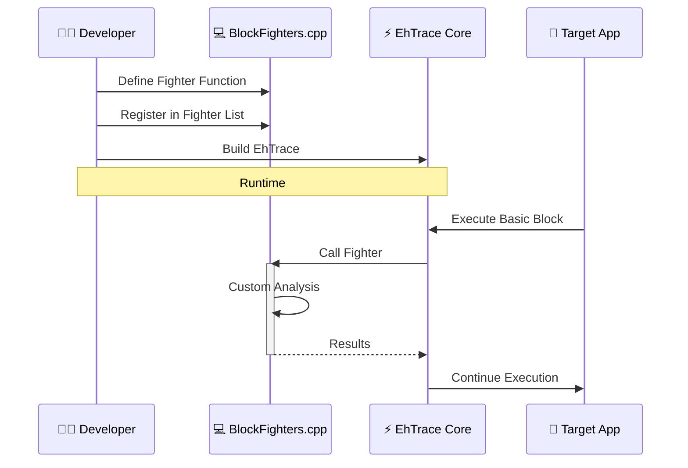
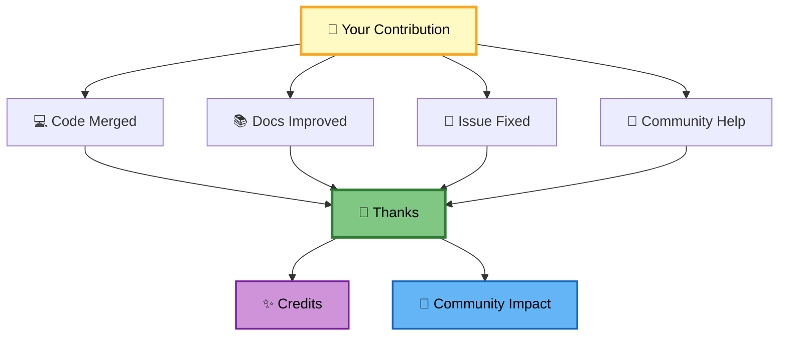
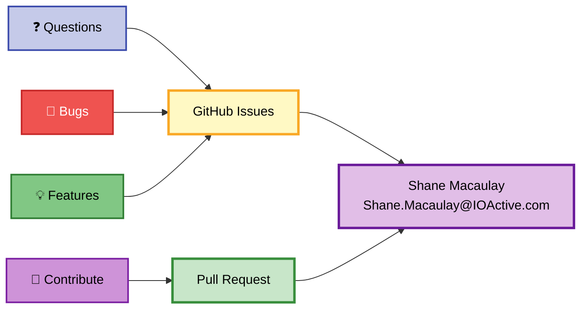

# 🤝 Contributing to EhTrace

> **Thank you for your interest in contributing to EhTrace!**

---

## 🎯 Ways to Contribute



---

## 🐛 Reporting Issues

### Before Reporting



### Issue Template

When reporting an issue, please include:

**🐛 Bug Description**
- Clear, concise description of the bug
- What you expected to happen
- What actually happened

**🔄 Reproduction Steps**
1. Step-by-step instructions to reproduce
2. Minimal test case if possible
3. Sample binaries or code (if safe to share)

**💻 Environment**
- OS version (Windows 10/11, build number)
- Visual Studio version
- EhTrace version/commit
- Target application details

**📋 Logs & Output**
- Relevant error messages
- Trace output
- Crash dumps (if applicable)
- Screenshots

**🔍 Additional Context**
- Any other relevant information
- Workarounds you've tried
- Related issues

---

## 💻 Code Contributions

### Development Workflow

```mermaid
graph LR
    subgraph Setup["⚙️ Setup"]
        Fork[Fork Repo]
        Clone[Clone Fork]
        Branch[Create Branch]
        
        style Fork fill:#e1bee7,stroke:#6a1b9a,stroke-width:2px,color:#000
        style Clone fill:#ce93d8,stroke:#7b1fa2,stroke-width:2px,color:#000
        style Branch fill:#ba68c8,stroke:#4a148c,stroke-width:2px,color:#000
    end
    
    subgraph Dev["👨‍💻 Development"]
        Code[Write Code]
        Test[Test Changes]
        Commit[Commit]
        
        style Code fill:#c8e6c9,stroke:#2e7d32,stroke-width:2px,color:#000
        style Test fill:#a5d6a7,stroke:#1b5e20,stroke-width:2px,color:#000
        style Commit fill:#81c784,stroke:#2e7d32,stroke-width:2px,color:#000
    end
    
    subgraph Submit["📤 Submit"]
        Push[Push Branch]
        PR[Create PR]
        Review[Code Review]
        
        style Push fill:#fff9c4,stroke:#f9a825,stroke-width:2px,color:#000
        style PR fill:#ffe082,stroke:#f57f17,stroke-width:2px,color:#000
        style Review fill:#ffd54f,stroke:#ff6f00,stroke-width:2px,color:#000
    end
    
    Fork --> Clone --> Branch
    Branch --> Code --> Test --> Commit
    Commit --> Push --> PR --> Review
    
    style Setup fill:#f3e5f5,stroke:#7b1fa2,stroke-width:3px
    style Dev fill:#e8f5e9,stroke:#388e3c,stroke-width:3px
    style Submit fill:#fffde7,stroke:#f57f17,stroke-width:3px
```



### Step-by-Step Guide

#### 1️⃣ Fork and Clone

```bash
# Fork the repository on GitHub first, then:
git clone https://github.com/YOUR-USERNAME/EhTrace.git
cd EhTrace
git remote add upstream https://github.com/K2/EhTrace.git
```

#### 2️⃣ Create a Branch

```bash
# Create a descriptive branch name
git checkout -b feature/my-awesome-feature
# or
git checkout -b fix/issue-123
```

#### 3️⃣ Make Your Changes

- Write clean, readable code
- Follow existing code style
- Add comments for complex logic
- Update documentation as needed

#### 4️⃣ Test Your Changes

```bash
# Build the project
msbuild EhTrace.sln /p:Configuration=Release /p:Platform=x64

# Test manually
Aload.exe notepad.exe x64\Release\EhTrace.dll

# Verify no regressions
```

#### 5️⃣ Commit Your Changes

```bash
# Stage your changes
git add .

# Write a descriptive commit message
git commit -m "Add feature: detailed description

- Bullet point 1
- Bullet point 2
- Fixes #123"
```

#### 6️⃣ Push and Create PR

```bash
# Push to your fork
git push origin feature/my-awesome-feature

# Create Pull Request on GitHub
# Fill out the PR template with details
```

---

## 📝 Coding Guidelines

### C++ Style

```cpp
// Use clear, descriptive names
void ProcessBasicBlock(PExecutionBlock pCtx) {
    // Comments for non-obvious logic
    if (IsRoPGadget(pCtx)) {
        LogRoPAttempt(pCtx);
    }
    
    // Proper error handling
    if (!ValidateContext(pCtx)) {
        return;
    }
}
```

### Code Structure



### Best Practices

✅ **DO:**
- Use meaningful variable names
- Keep functions focused and small
- Handle errors gracefully
- Document complex algorithms
- Test edge cases
- Maintain backward compatibility

❌ **DON'T:**
- Use magic numbers (define constants)
- Create deep nesting (refactor)
- Introduce global state unnecessarily
- Duplicate code (extract common logic)
- Break existing functionality
- Introduce security vulnerabilities

---

## 🧪 Testing Contributions

### Testing Checklist



### Test Your Changes

1. **🏗️ Build Test**
   ```bash
   msbuild EhTrace.sln /p:Configuration=Debug /p:Platform=x64
   msbuild EhTrace.sln /p:Configuration=Release /p:Platform=x64
   ```

2. **⚡ Basic Functionality**
   ```bash
   # Test with simple application
   Aload.exe notepad.exe EhTrace.dll
   
   # Verify trace collection
   Acleanout.exe > test_trace.log
   ```

3. **🔍 Edge Cases**
   - Test with various target applications
   - Test different injection methods
   - Test with/without symbols
   - Test performance impact

4. **🔄 Regression Testing**
   - Verify existing features still work
   - Check that old issues don't resurface
   - Test with known working configurations

---

## 📚 Documentation Contributions

### Documentation Standards



### Documentation Types

**📖 Code Documentation**
- Inline comments for complex logic
- Function/class documentation
- API documentation

**📚 User Documentation**
- Usage guides
- Tutorials
- Examples

**🏗️ Technical Documentation**
- Architecture details
- Design decisions
- Performance considerations

---

## 🎨 Custom Fighters

### Creating a Custom Fighter



### Fighter Template

```cpp
// Custom fighter function
void MyCustomFighter(PVOID pCtx) {
    PExecutionBlock ctx = (PExecutionBlock)pCtx;
    
    // Access execution context
    ULONGLONG fromAddr = ctx->BlockFrom;
    ULONGLONG toAddr = ctx->BlockTo;
    
    // Your custom analysis logic here
    if (IsInterestingPattern(fromAddr, toAddr)) {
        LogCustomEvent(ctx);
    }
}

// Initialization function (optional)
void InitMyCustomFighter() {
    // One-time setup
    SetupCustomState();
}

// Register in BlockFighters.cpp
BlockFighters myFighters[] = {
    { 
        NULL,                       // Module filter (NULL = all)
        "MyCustomFighter",          // Name
        DEFENSIVE_MOVE,             // Move type
        NO_FIGHTER,                 // Type
        InitMyCustomFighter,        // Init function
        MyCustomFighter             // Fighter function
    },
    // ... other fighters
};
```

---

## 🏆 Recognition



Contributors are recognized in:
- 📝 Commit messages (co-authored)
- 📚 Documentation
- 🎉 Release notes
- 👥 Contributors list

---

## 📜 Code of Conduct

### Our Standards

✅ **Positive Environment**
- Be respectful and inclusive
- Welcome newcomers
- Provide constructive feedback
- Acknowledge contributions

❌ **Unacceptable Behavior**
- Harassment or discrimination
- Offensive language
- Personal attacks
- Publishing private information

---

## 📞 Contact



**Need Help?**
- 💬 GitHub Issues: For bugs, features, questions
- 📧 Email: Shane.Macaulay@IOActive.com
- 🌐 GitHub Discussions: For general discussion

---

> 🎯 **Together we make EhTrace better!**

Thank you for contributing to EhTrace! 🙏
