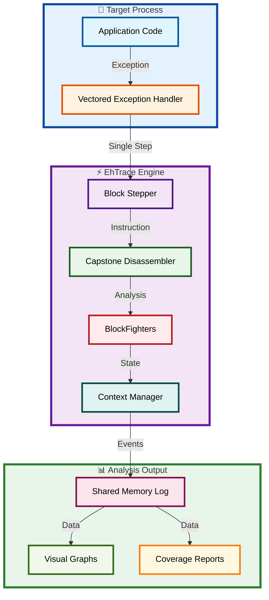
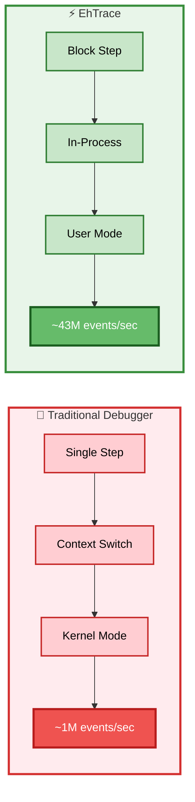
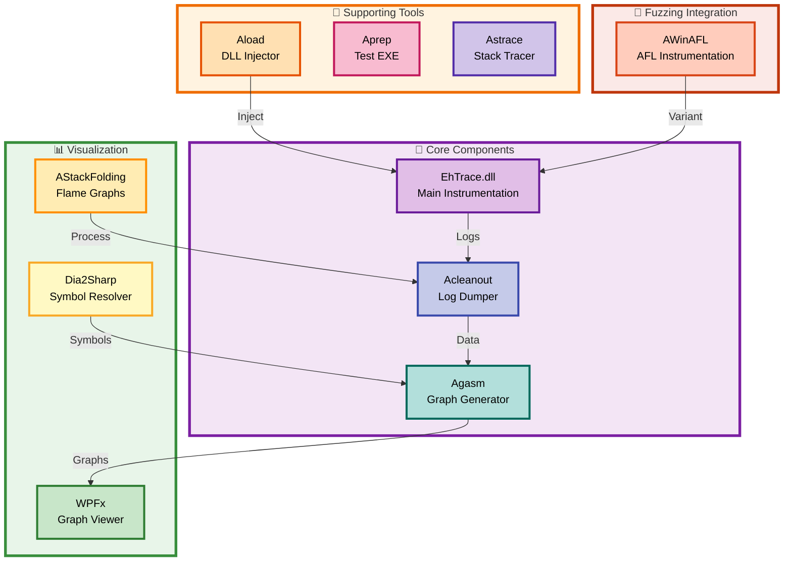

# EhTrace


**EhTrace** (pronounced "ATrace") is a high-performance binary tracing and instrumentation framework for Windows. It enables deep runtime analysis of Windows executables without requiring source code, binary modifications, or traditional debugging.

## Overview

EhTrace leverages Windows Vectored Exception Handling (VEH) and block-stepping techniques to provide comprehensive execution tracing with minimal overhead. Unlike traditional debugging or instrumentation tools, EhTrace operates entirely in-process and requires no patches to target binaries.

### Key Features

- **Zero Binary Modification**: Trace execution without altering the target binary
- **High Performance**: Block stepping instead of single stepping achieves ~43 million events per second
- **Complete Code Coverage**: Automatic basic block detection and tracking
- **Register State Monitoring**: Capture and analyze register states during execution
- **No Debug Mode Required**: Works without enabling CPU debug/trace MSR capabilities
- **In-Process Operation**: Minimal context switching overhead compared to traditional debuggers
- **Multiple Instrumentation Modes**: Support for various tracing and analysis scenarios

### Core Capabilities

- **Execution Flow Analysis**: Track program execution paths and control flow
- **Code Coverage Mapping**: Generate comprehensive code coverage reports
- **RoP Defense**: Detect and prevent Return-Oriented Programming attacks through call/ret balancing
- **Key Escrow**: Cryptographic key interception and escrow capabilities
- **Fuzzing Integration**: AFL-compatible fuzzing instrumentation (AWinAFL)
- **Symbol Resolution**: Automatic symbol loading and resolution via DIA2

## Architecture



### Core Operating Principles

EhTrace operates through a sophisticated pipeline:

1. **🛡️ Exception Handling**: Registering a Vectored Exception Handler (VEH)
2. **👣 Block Stepping**: Using single-step exceptions at basic block boundaries
3. **🔍 Disassembly**: Leveraging Capstone for on-the-fly instruction analysis
4. **📝 Logging**: Writing execution events to shared memory for external analysis
5. **⚔️ Fighting**: Applying configurable "BlockFighters" for security and analysis tasks

The framework maintains execution state per-thread using specialized context structures and provides hooks for customizable instrumentation.

## Performance



EhTrace achieves high performance through several optimizations:

- **🎯 Branch stepping vs single stepping**: Only trace at basic block boundaries
- **⚡ In-process operation**: No debugger context switches
- **⏱️ Temporal state management**: VEH naturally maintains execution state
- **💾 Efficient logging**: Shared memory buffers for high-throughput event recording

**📊 Benchmark**: **428,833,152 events** (32 bytes each) captured in 10 seconds = **~43M events/sec**

## Example Output

CSW16 demo tracing notepad.exe without symbols:


Basic block graph with Capstone disassembly:


Code coverage visualization:


## Components



The EhTrace ecosystem consists of several integrated projects:

### Core Components

- **EhTrace**: The main instrumentation DLL (can also be built as EXE for testing)
- **Acleanout**: Dumps trace logs from shared memory created by EhTrace
- **Agasm**: Glue/disassembly tool for generating graphs with symbols and Capstone integration

### Supporting Tools

- **Aload**: DLL injection utility
- **Aprep**: Test executable (EhTrace built as EXE)
- **Astrace**: Stack tracing utilities
- **AKeyTest**: Cryptographic key escrow testing

### Fuzzing Integration

- **AWinAFL**: AFL-compatible fuzzing instrumentation for Windows

### Visualization

- **WPFx**: WPF-based visualization using MSAGL graphing library
- **Dia2Sharp**: C# DIA2 wrapper for symbol processing
- **TestDump2**: Test application for Dia2Sharp
- **Amerger**: Log merging utilities
- **AStackFolding**: Stack trace folding for flame graph generation

## Prerequisites

### Build Requirements

- Visual Studio 2015 or later (C++ toolchain)
- Windows SDK
- .NET Framework (for visualization tools)

### Runtime Dependencies

- **dbghelp.dll**: Symbol resolution (included in support directory)
- **symsrv.dll**: Symbol server support (included in support directory)
- **Capstone**: Disassembly engine (libraries in support directory)
- **MSAGL**: Graph visualization (Microsoft Automatic Graph Layout)

## Building

1. Open `EhTrace.sln` in Visual Studio
2. Select your target configuration (Debug/Release) and platform (x86/x64)
3. Build the solution

For detailed build instructions, see [BUILDING.md](BUILDING.md)

## Usage

### Basic Tracing

1. Build or obtain EhTrace.dll
2. Inject EhTrace.dll into target process using Aload or your preferred injection method
3. Run the target application
4. Collect trace data using Acleanout
5. Visualize results using WPFx or custom analysis tools

### Example Workflow

```batch
# Build EhTrace
msbuild EhTrace.sln /p:Configuration=Release /p:Platform=x64

# Inject into target
Aload.exe target.exe EhTrace.dll

# Collect trace data
Acleanout.exe > trace.log

# Analyze with Agasm
Agasm.exe trace.log output.graph
```

For comprehensive usage documentation, see [USAGE.md](USAGE.md)

## Configuration

EhTrace supports runtime configuration through the BlockFighters framework. Configure tracing behavior by modifying the fighter configuration in your build.

Available fighters:
- **RoP Fighter**: Detects ROP gadget chains
- **Key Escrow Fighter**: Intercepts cryptographic operations
- **AFL Fighter**: Provides fuzzing instrumentation
- **Custom Fighters**: Implement your own analysis logic

## Development

### Project Structure

```
EhTrace/
├── EhTrace/          # Core instrumentation DLL
├── prep/             # Supporting tools and utilities
├── vis/              # Visualization components
├── support/          # Dependencies and resources
├── doc/              # Documentation
└── afl-fuzz/         # AFL fuzzing integration
```

### Key Source Files

- `EhTrace.cpp`: Main VEH handler and core logic
- `BlockFighters.cpp`: Fighter framework implementation
- `Config.cpp`: Configuration and symbol management
- `GlobLog.cpp`: Shared memory logging
- `KeyEscrow.cpp`: Cryptographic key interception
- `RoP-Defender.cpp`: ROP detection logic

## License

This project is licensed under the GNU Affero General Public License v3.0 - see the [LICENSE](LICENSE) file for details.

Copyright (C) 2014-2016 Shane Macaulay

## Contributing

Contributions are welcome! Please ensure your code follows the existing style and includes appropriate testing.

## Author

Shane Macaulay (Shane.Macaulay@IOActive.com)

## Acknowledgments

- Capstone disassembly framework
- Microsoft Automatic Graph Layout (MSAGL)
- AFL fuzzing framework
- The security research community

## References

For more technical details, see:
- [ARCHITECTURE.md](ARCHITECTURE.md) - Technical architecture documentation
- [doc/](doc/) - Additional documentation and presentations 
