# 🚀 Using EhTrace

> **Comprehensive guide to binary tracing, analysis, and security research with EhTrace**

---

## 📋 Table of Contents

- [Quick Start](#-quick-start)
- [Basic Usage](#-basic-usage)
- [Advanced Usage](#-advanced-usage)
- [Configuration](#-configuration)
- [Analysis Workflows](#-analysis-workflows)
- [Troubleshooting](#-troubleshooting)

---

## ⚡ Quick Start

### Minimal Example

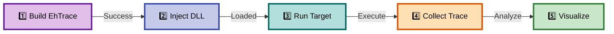

**Commands:**

```batch
# 1. Build EhTrace (see BUILDING.md)
msbuild EhTrace.sln /p:Configuration=Release /p:Platform=x64

# 2. Inject into target process
Aload.exe notepad.exe x64\Release\EhTrace.dll

# 3. Interact with the target application
# (use notepad normally)

# 4. Collect trace data
Acleanout.exe > trace.log

# 5. Visualize (optional)
WPFx.exe trace.log
```

---

## 🎯 Basic Usage

### DLL Injection Methods

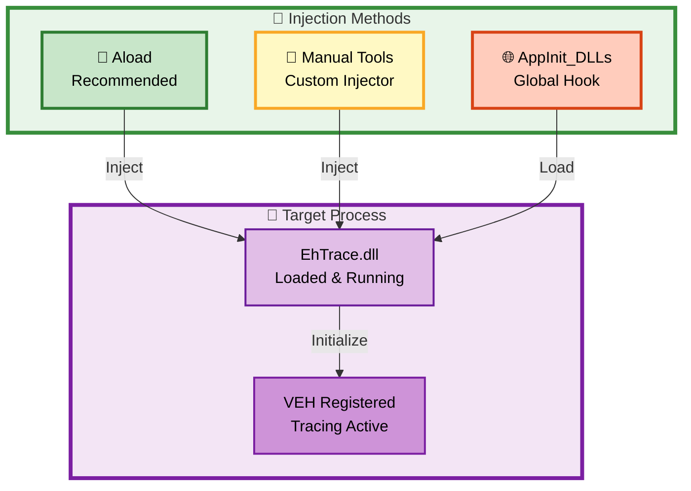

#### Method 1: Using Aload (Recommended)

```batch
# Inject EhTrace.dll into a new process
Aload.exe <target.exe> <path\to\EhTrace.dll>

# Example
Aload.exe C:\Windows\System32\notepad.exe x64\Release\EhTrace.dll
```

#### Method 2: Manual Injection

Use any DLL injection tool that supports:
- CreateRemoteThread
- QueueUserAPC
- SetWindowsHookEx
- Manual mapping

#### Method 3: AppInit_DLLs (Global Injection)

⚠️ **Warning**: This affects all processes and requires careful configuration.

1. Add EhTrace.dll path to registry:
   ```reg
   HKEY_LOCAL_MACHINE\SOFTWARE\Microsoft\Windows NT\CurrentVersion\Windows\AppInit_DLLs
   ```
2. Set `LoadAppInit_DLLs` to 1
3. Restart affected processes

### Collecting Trace Data

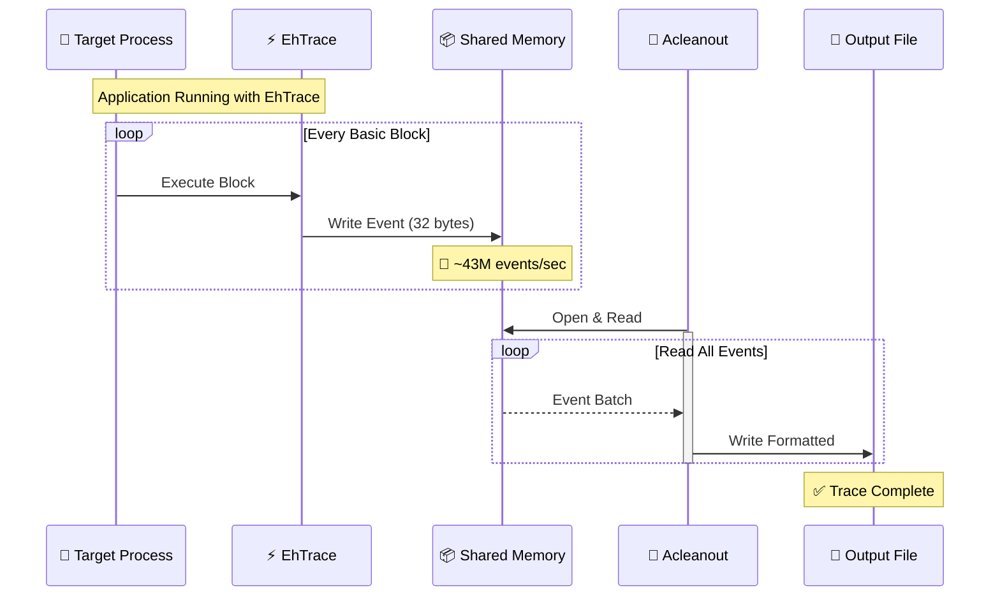

#### Using Acleanout

Acleanout dumps the shared memory buffer where EhTrace logs execution events.

```batch
# Dump to console
Acleanout.exe

# Save to file
Acleanout.exe > trace.log

# Continuous monitoring
Acleanout.exe --continuous > trace.log
```

#### Shared Memory Format

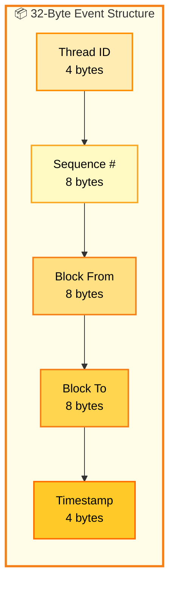

EhTrace creates a shared memory section containing:
- **Thread ID**: Which thread executed the block
- **Sequence number**: Monotonic event counter
- **Source address (from)**: Starting address of basic block
- **Target address (to)**: Target address of control transfer
- **Timestamp**: High-resolution timestamp

### Analyzing Traces

#### Using Agasm (Disassembly and Graph Generation)

```batch
# Generate basic graph
Agasm.exe trace.log output.graph

# With symbols
Agasm.exe trace.log output.graph --symbols C:\Symbols

# With disassembly
Agasm.exe trace.log output.graph --disasm
```

#### Using WPFx (Visualization)

```batch
# Launch GUI
WPFx.exe

# Load trace file through GUI
# File → Open → Select trace.log
```

WPFx provides:
- Interactive graph visualization
- Code coverage heatmaps
- Call graph exploration
- Symbol resolution
- Flame graph generation

---

## 🔬 Advanced Usage

### Code Coverage Analysis

```mermaid
flowchart TD
    Start([🎬 Start Coverage Analysis])
    
    subgraph Setup["⚙️ Setup Phase"]
        Inject[Inject EhTrace]
        Init[Initialize Tracing]
        style Inject fill:#e1bee7,stroke:#6a1b9a,stroke-width:2px,color:#000
        style Init fill:#ce93d8,stroke:#7b1fa2,stroke-width:2px,color:#000
    end
    
    subgraph Execute["🎯 Execution Phase"]
        Test1[Feature Test 1]
        Test2[Feature Test 2]
        TestN[Feature Test N]
        style Test1 fill:#c5cae9,stroke:#3949ab,stroke-width:2px,color:#000
        style Test2 fill:#9fa8da,stroke:#283593,stroke-width:2px,color:#000
        style TestN fill:#7986cb,stroke:#1a237e,stroke-width:2px,color:#fff
    end
    
    subgraph Collect["📊 Collection Phase"]
        Dump[Dump Trace]
        Merge[Merge Events]
        Dedup[Deduplicate Blocks]
        style Dump fill:#b2dfdb,stroke:#00695c,stroke-width:2px,color:#000
        style Merge fill:#80cbc4,stroke:#004d40,stroke-width:2px,color:#000
        style Dedup fill:#4db6ac,stroke:#00251a,stroke-width:2px,color:#fff
    end
    
    subgraph Analyze["📈 Analysis Phase"]
        Coverage[Calculate Coverage]
        Report[Generate Report]
        Visualize[Create Heatmap]
        style Coverage fill:#ffe0b2,stroke:#e65100,stroke-width:2px,color:#000
        style Report fill:#ffccbc,stroke:#d84315,stroke-width:2px,color:#000
        style Visualize fill:#ffab91,stroke:#bf360c,stroke-width:2px,color:#000
    end
    
    Start --> Setup
    Setup --> Inject --> Init
    Init --> Execute
    Execute --> Test1 --> Test2 --> TestN
    TestN --> Collect
    Collect --> Dump --> Merge --> Dedup
    Dedup --> Analyze
    Analyze --> Coverage --> Report --> Visualize
    Visualize --> End([✅ Coverage Complete])
    
    style Start fill:#81c784,stroke:#2e7d32,stroke-width:3px,color:#000
    style End fill:#81c784,stroke:#2e7d32,stroke-width:3px,color:#000
    style Setup fill:#f3e5f5,stroke:#7b1fa2,stroke-width:3px
    style Execute fill:#e8eaf6,stroke:#3949ab,stroke-width:3px
    style Collect fill:#e0f2f1,stroke:#00695c,stroke-width:3px
    style Analyze fill:#fff3e0,stroke:#e65100,stroke-width:3px
```

To generate code coverage reports:

1. Inject EhTrace into the target
2. Exercise all features of the target application
3. Collect the trace
4. Analyze coverage using Agasm or WPFx

```batch
# Generate coverage report
Agasm.exe trace.log coverage.html --format html --coverage
```

### Fuzzing Integration (AWinAFL)

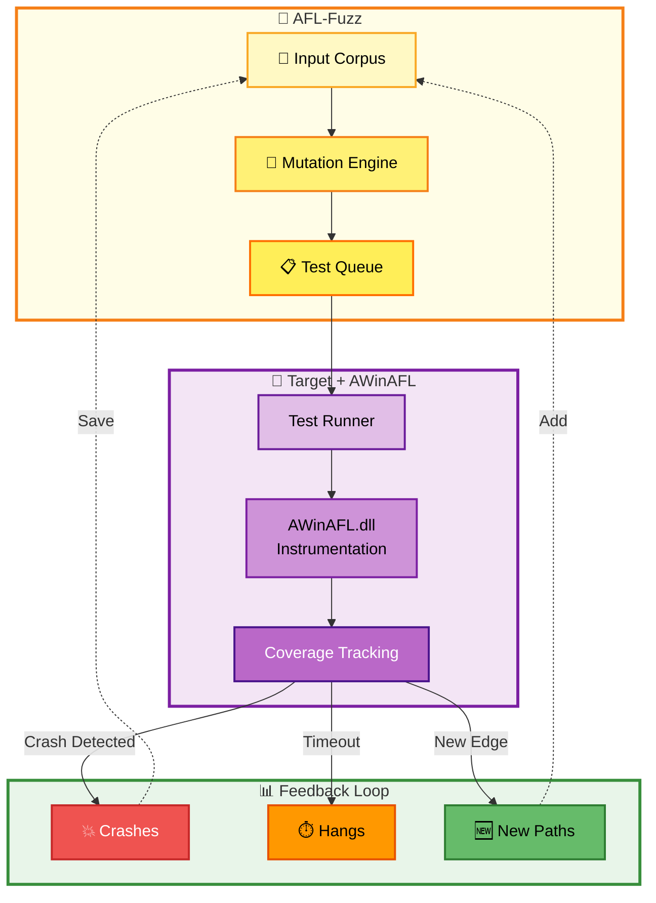

EhTrace supports AFL-style fuzzing through AWinAFL:

```batch
# Build with AFL fighter
# (ensure AFL_FIGHTER is configured in BlockFighters)

# Inject AWinAFL.dll instead of EhTrace.dll
Aload.exe target.exe prep\AWinAFL\x64\Release\AWinAFL.dll

# Use with AFL
afl-fuzz -i input -o output -D <path> -- target.exe @@
```

AWinAFL provides:
- Basic block coverage instrumentation
- Edge coverage tracking
- Crash detection and reporting
- Integration with AFL fuzzing workflow

### RoP Detection

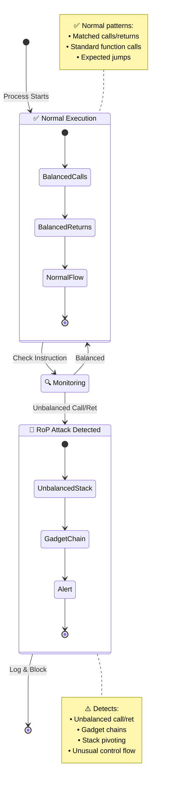

The RoP Defender fighter detects Return-Oriented Programming attacks:

```batch
# Enable RoP defender (built-in by default)
# Inject EhTrace normally
Aload.exe suspicious.exe EhTrace.dll

# Check for RoP alerts in trace
Acleanout.exe | findstr "ROP_ALERT"
```

The RoP fighter detects:
- Unbalanced call/ret sequences
- Gadget chains
- Stack pivoting
- Unusual control flow patterns

### Key Escrow

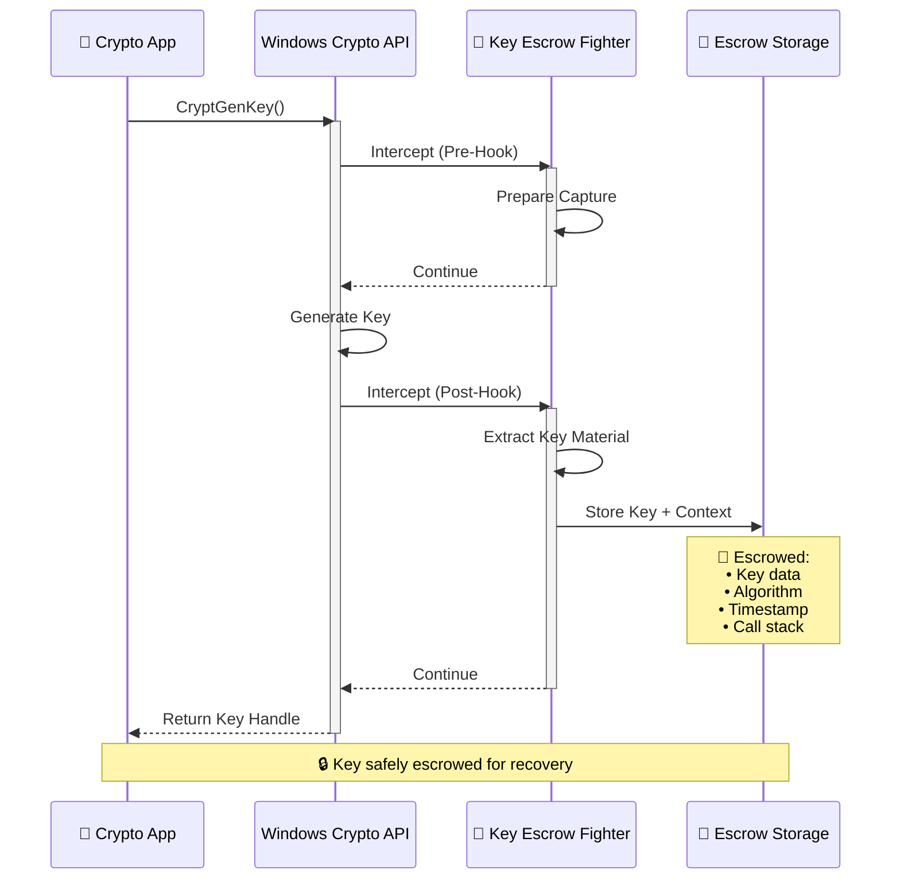

The Key Escrow fighter intercepts cryptographic operations:

```batch
# Enable key escrow (requires InitKeyFighter)
# Inject EhTrace into crypto application
Aload.exe cryptoapp.exe EhTrace.dll

# Captured keys are logged to shared memory
# Extract with Acleanout
Acleanout.exe > keys.log
```

Intercepted operations:
- CryptGenKey
- CryptImportKey
- CryptExportKey
- CryptGenRandom
- CryptEncrypt/CryptDecrypt

### Custom Fighters

To implement custom analysis logic:

1. Edit `EhTrace/BlockFighters.cpp`
2. Add your fighter function:
   ```cpp
   void MyCustomFighter(PVOID pCtx) {
       PExecutionBlock ctx = (PExecutionBlock)pCtx;
       // Your analysis logic here
       // Access: ctx->BlockFrom, ctx->BlockTo, ctx->Registers, etc.
   }
   ```
3. Register in the fighter list:
   ```cpp
   BlockFighters myFighters[] = {
       { NULL, "MyCustomFighter", DEFENSIVE_MOVE, NO_FIGHTER, NULL, MyCustomFighter },
       // ... other fighters
   };
   ```
4. Rebuild EhTrace

---

## ⚙️ Configuration

### Configuration Overview

```mermaid
graph TB
    subgraph Env["🌍 Environment Variables"]
        SYM[_NT_SYMBOL_PATH<br/>Symbol Server]
        ALT[_NT_ALT_SYMBOL_PATH<br/>Alternative Server]
        BUF[EHTRACE_BUFFER_SIZE<br/>Memory Size]
        VERB[EHTRACE_VERBOSE<br/>Debug Logging]
        
        style SYM fill:#c5cae9,stroke:#3949ab,stroke-width:2px,color:#000
        style ALT fill:#9fa8da,stroke:#283593,stroke-width:2px,color:#000
        style BUF fill:#7986cb,stroke:#1a237e,stroke-width:2px,color:#fff
        style VERB fill:#5c6bc0,stroke:#1a237e,stroke-width:2px,color:#fff
    end
    
    subgraph Code["💻 Code Configuration"]
        FIGHT[BlockFighters.cpp<br/>Fighter List]
        HOOKS[Config.cpp<br/>Hook Points]
        FLAGS[Preprocessor Defines<br/>Build Flags]
        
        style FIGHT fill:#ffccbc,stroke:#d84315,stroke-width:2px,color:#000
        style HOOKS fill:#ffab91,stroke:#bf360c,stroke-width:2px,color:#000
        style FLAGS fill:#ff8a65,stroke:#bf360c,stroke-width:2px,color:#000
    end
    
    subgraph Runtime["⚡ Runtime Behavior"]
        TRACE[Trace Capture]
        ANALYZE[Analysis Logic]
        OUTPUT[Output Format]
        
        style TRACE fill:#c8e6c9,stroke:#2e7d32,stroke-width:2px,color:#000
        style ANALYZE fill:#a5d6a7,stroke:#1b5e20,stroke-width:2px,color:#000
        style OUTPUT fill:#81c784,stroke:#2e7d32,stroke-width:2px,color:#000
    end
    
    Env --> Runtime
    Code --> Runtime
    
    SYM -.-> TRACE
    BUF -.-> TRACE
    FIGHT -.-> ANALYZE
    HOOKS -.-> ANALYZE
    
    style Env fill:#e8eaf6,stroke:#3949ab,stroke-width:3px
    style Code fill:#fff3e0,stroke:#d84315,stroke-width:3px
    style Runtime fill:#e8f5e9,stroke:#388e3c,stroke-width:3px
```

### Environment Variables

```batch
# Symbol path (standard _NT_SYMBOL_PATH format)
set _NT_SYMBOL_PATH=srv*c:\symbols*https://msdl.microsoft.com/download/symbols

# Alternative symbol server
set _NT_ALT_SYMBOL_PATH=srv*c:\localsymbols*https://internal.symbols.server

# Trace buffer size (in pages, default 65536)
set EHTRACE_BUFFER_SIZE=131072

# Enable verbose logging
set EHTRACE_VERBOSE=1
```

### Fighter Configuration

Edit `EhTrace/BlockFighters.cpp` to enable/disable fighters:

```cpp
BlockFighters staticList[] = {
    // RoP Detection (enabled)
    { NULL, "RoPFighter", DEFENSIVE_MOVE, ROP_FIGHTER, InitRoPFighter, RoPFighter },
    
    // Key Escrow (enabled)
    { NULL, "KeyFighter", DEFENSIVE_MOVE, ESCROW_FIGHTER, InitKeyFighter, KeyFighter },
    
    // AFL Fuzzing (disabled - uncomment to enable)
    // { NULL, "AFLFighter", DEFENSIVE_MOVE, AFL_FIGHTER, InitAFLFighter, AFLFighter },
};
```

### Hook Configuration

Edit hook points in `Config.cpp`:

```cpp
HookInfo HooksConfig[] = {
    // Hook CryptGenRandom
    { "CryptGenRandom", FLAGS_POST | FLAGS_RESOLVE, NULL, NULL, 2, 3, 0, NULL },
    
    // Hook malloc/free
    { "malloc", FLAGS_PRE, NULL, NULL, 1, 1, 0, NULL },
    { "free", FLAGS_POST, NULL, NULL, 1, 1, 0, NULL },
    
    // Add your hooks here
};
```

---

## 🔄 Analysis Workflows

### Workflow 1: Basic Code Coverage

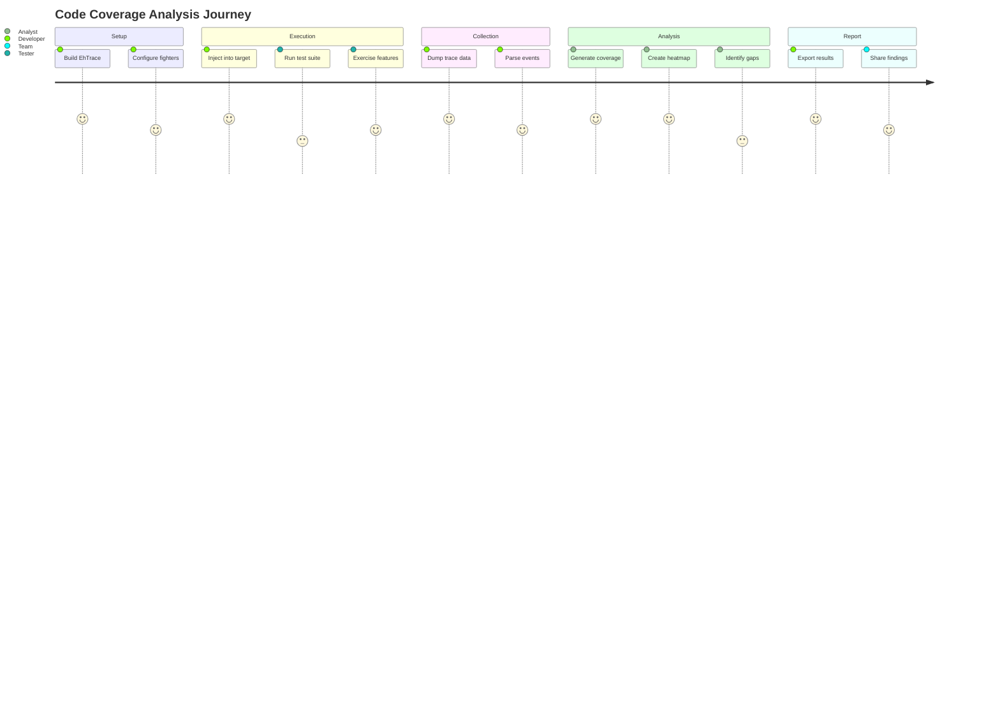

**Commands:**

```batch
# 1. Build EhTrace
msbuild EhTrace.sln /p:Configuration=Release /p:Platform=x64

# 2. Run target with instrumentation
Aload.exe target.exe x64\Release\EhTrace.dll

# 3. Exercise target functionality
# (interact with target application)

# 4. Collect trace
Acleanout.exe > coverage.trace

# 5. Visualize
WPFx.exe coverage.trace
```

### Workflow 2: Vulnerability Research

```mermaid
flowchart TD
    Start([🔍 Start Vuln Research])
    
    subgraph Prep["📋 Preparation"]
        Target[Identify Target]
        Hypothesis[Form Hypothesis]
        Setup[Setup EhTrace]
        style Target fill:#fff9c4,stroke:#f9a825,stroke-width:2px,color:#000
        style Hypothesis fill:#fff176,stroke:#f57f17,stroke-width:2px,color:#000
        style Setup fill:#ffee58,stroke:#ff6f00,stroke-width:2px,color:#000
    end
    
    subgraph Exploit["💣 Exploitation"]
        Inject[Inject EhTrace]
        Input[Provide Malicious Input]
        Monitor[Monitor Execution]
        style Inject fill:#e1bee7,stroke:#6a1b9a,stroke-width:2px,color:#000
        style Input fill:#ce93d8,stroke:#7b1fa2,stroke-width:2px,color:#000
        style Monitor fill:#ba68c8,stroke:#4a148c,stroke-width:2px,color:#fff
    end
    
    subgraph Detect["🚨 Detection"]
        Crash{Crash?}
        RoP{RoP Alert?}
        Anomaly{Anomaly?}
        style Crash fill:#ef5350,stroke:#c62828,stroke-width:2px,color:#fff
        style RoP fill:#ff9800,stroke:#e65100,stroke-width:2px,color:#000
        style Anomaly fill:#ffa726,stroke:#ef6c00,stroke-width:2px,color:#000
    end
    
    subgraph Analysis["🔬 Analysis"]
        Trace[Analyze Trace]
        Graph[Generate Graph]
        RCA[Root Cause Analysis]
        style Trace fill:#b2dfdb,stroke:#00695c,stroke-width:2px,color:#000
        style Graph fill:#80cbc4,stroke:#004d40,stroke-width:2px,color:#000
        style RCA fill:#4db6ac,stroke:#00251a,stroke-width:2px,color:#fff
    end
    
    subgraph Report["📊 Reporting"]
        Document[Document Findings]
        POC[Create PoC]
        Disclose[Responsible Disclosure]
        style Document fill:#c5cae9,stroke:#3949ab,stroke-width:2px,color:#000
        style POC fill:#9fa8da,stroke:#283593,stroke-width:2px,color:#000
        style Disclose fill:#7986cb,stroke:#1a237e,stroke-width:2px,color:#fff
    end
    
    Start --> Prep
    Prep --> Target --> Hypothesis --> Setup
    Setup --> Exploit
    Exploit --> Inject --> Input --> Monitor
    Monitor --> Detect
    Detect --> Crash
    Detect --> RoP
    Detect --> Anomaly
    
    Crash -->|Yes| Analysis
    RoP -->|Yes| Analysis
    Anomaly -->|Yes| Analysis
    
    Analysis --> Trace --> Graph --> RCA
    RCA --> Report
    Report --> Document --> POC --> Disclose
    Disclose --> End([✅ Research Complete])
    
    style Start fill:#81c784,stroke:#2e7d32,stroke-width:3px,color:#000
    style End fill:#81c784,stroke:#2e7d32,stroke-width:3px,color:#000
    style Prep fill:#fffde7,stroke:#f57f17,stroke-width:3px
    style Exploit fill:#f3e5f5,stroke:#7b1fa2,stroke-width:3px
    style Detect fill:#fbe9e7,stroke:#d84315,stroke-width:3px
    style Analysis fill:#e0f2f1,stroke:#00695c,stroke-width:3px
    style Report fill:#e8eaf6,stroke:#3949ab,stroke-width:3px
```

**Commands:**

```batch
# 1. Inject into potentially vulnerable app
Aload.exe vulnerable.exe EhTrace.dll

# 2. Provide malicious input
vulnerable.exe < exploit.dat

# 3. Check for RoP or other anomalies
Acleanout.exe | findstr "ALERT\|WARNING\|ANOMALY"

# 4. Analyze execution path
Agasm.exe trace.log exploit_analysis.graph --disasm
```

### Workflow 3: Malware Analysis

```batch
# 1. Set up isolated environment (VM recommended)

# 2. Inject into malware sample
Aload.exe malware.exe EhTrace.dll

# 3. Allow malware to execute (safely isolated)

# 4. Collect comprehensive trace
Acleanout.exe > malware_trace.log

# 5. Analyze behavior
Agasm.exe malware_trace.log behavior.graph --symbols
WPFx.exe malware_trace.log
```

### Workflow 4: Performance Profiling

```batch
# 1. Inject into application
Aload.exe app.exe EhTrace.dll

# 2. Run performance test
app.exe --benchmark

# 3. Generate flame graph
Agasm.exe trace.log flame.svg --format flamegraph

# 4. Identify hotspots
# (analyze flame.svg to find performance bottlenecks)
```

---

## 🔧 Troubleshooting

### Common Issues Decision Tree

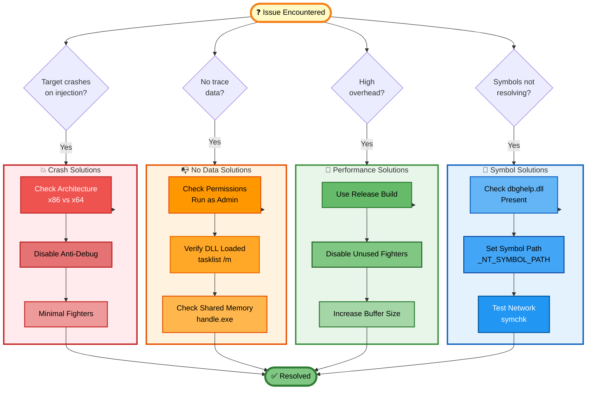

#### Issue: Target crashes on injection

**Causes**:
- Architecture mismatch (x86 vs x64)
- Anti-debugging protection
- Incompatible fighter configuration

**Solutions**:
```batch
# Verify architecture match
dumpbin /HEADERS target.exe | findstr "machine"
dumpbin /HEADERS EhTrace.dll | findstr "machine"

# Try with minimal fighters (disable all in BlockFighters.cpp)

# Check for anti-debug
# (use x64dbg or WinDbg to verify)
```

#### Issue: No trace data collected

**Causes**:
- Shared memory not created
- Target terminated before trace collection
- Insufficient permissions

**Solutions**:
```batch
# Run as administrator
runas /user:Administrator "Aload.exe target.exe EhTrace.dll"

# Check process handles
handle.exe -a | findstr "EhTraceConfigure"

# Verify DLL loaded
tasklist /m EhTrace.dll
```

#### Issue: High performance overhead

**Causes**:
- Too many fighters enabled
- Verbose logging
- Symbol resolution overhead

**Solutions**:
- Disable unnecessary fighters
- Build Release configuration
- Pre-cache symbols
- Reduce trace buffer size

#### Issue: Symbols not resolving

**Causes**:
- Missing dbghelp.dll/symsrv.dll
- Incorrect symbol path
- Network access issues

**Solutions**:
```batch
# Verify DLLs present
dir support\dbghelp.dll
dir support\symsrv.dll

# Set symbol path
set _NT_SYMBOL_PATH=srv*c:\symbols*https://msdl.microsoft.com/download/symbols

# Test symbol server
symchk /s SRV*c:\symbols*https://msdl.microsoft.com/download/symbols target.exe
```

### Debug Mode

Build EhTrace in Debug configuration for detailed diagnostics:

```batch
msbuild EhTrace.sln /p:Configuration=Debug /p:Platform=x64

# Run with debugger attached
windbg -o Aload.exe target.exe x64\Debug\EhTrace.dll
```

### Logging

Enable verbose logging for troubleshooting:

```cpp
// In EhTrace.cpp, uncomment or add:
#define ENABLE_VERBOSE_LOGGING
```

### Performance Considerations

```mermaid
graph TB
    subgraph Configs["⚙️ Configuration Impact"]
        direction TB
        C1[Release Build<br/>✅ Optimized]
        C2[Debug Build<br/>❌ Slow]
        C3[Minimal Fighters<br/>✅ Fast]
        C4[All Fighters<br/>❌ Overhead]
        C5[Large Buffer<br/>✅ Efficient]
        C6[Small Buffer<br/>❌ Contention]
        
        style C1 fill:#c8e6c9,stroke:#2e7d32,stroke-width:2px,color:#000
        style C2 fill:#ffcdd2,stroke:#c62828,stroke-width:2px,color:#000
        style C3 fill:#c8e6c9,stroke:#2e7d32,stroke-width:2px,color:#000
        style C4 fill:#ffcdd2,stroke:#c62828,stroke-width:2px,color:#000
        style C5 fill:#c8e6c9,stroke:#2e7d32,stroke-width:2px,color:#000
        style C6 fill:#ffcdd2,stroke:#c62828,stroke-width:2px,color:#000
    end
    
    subgraph Metrics["📊 Performance Metrics"]
        direction TB
        M1[⚡ Event Rate<br/>30-50M/sec]
        M2[📉 Overhead<br/>10-30% slowdown]
        M3[💾 Memory<br/>100-500 MB]
        
        style M1 fill:#fff9c4,stroke:#f9a825,stroke-width:2px,color:#000
        style M2 fill:#ffe082,stroke:#f57f17,stroke-width:2px,color:#000
        style M3 fill:#ffd54f,stroke:#ff6f00,stroke-width:2px,color:#000
    end
    
    subgraph Tips["💡 Optimization Tips"]
        direction TB
        T1[1️⃣ Use Release builds]
        T2[2️⃣ Disable unused fighters]
        T3[3️⃣ Increase buffer size]
        T4[4️⃣ Use local symbol cache]
        T5[5️⃣ Profile specific threads]
        
        style T1 fill:#e1bee7,stroke:#6a1b9a,stroke-width:2px,color:#000
        style T2 fill:#ce93d8,stroke:#7b1fa2,stroke-width:2px,color:#000
        style T3 fill:#ba68c8,stroke:#4a148c,stroke-width:2px,color:#000
        style T4 fill:#ab47bc,stroke:#6a1b9a,stroke-width:2px,color:#fff
        style T5 fill:#9c27b0,stroke:#4a148c,stroke-width:2px,color:#fff
    end
    
    Configs -.->|Achieve| Metrics
    Tips -.->|Improve| Metrics
    
    style Configs fill:#e8f5e9,stroke:#388e3c,stroke-width:3px
    style Metrics fill:#fffde7,stroke:#f57f17,stroke-width:3px
    style Tips fill:#f3e5f5,stroke:#7b1fa2,stroke-width:3px
```

### Expected Performance

Expected performance (varies by target):

- **⚡ Event rate**: 30-50 million events/second
- **📉 Overhead**: 10-30% slowdown (vs native execution)
- **💾 Memory**: 100-500 MB for trace buffers

---

## 🎓 Next Steps

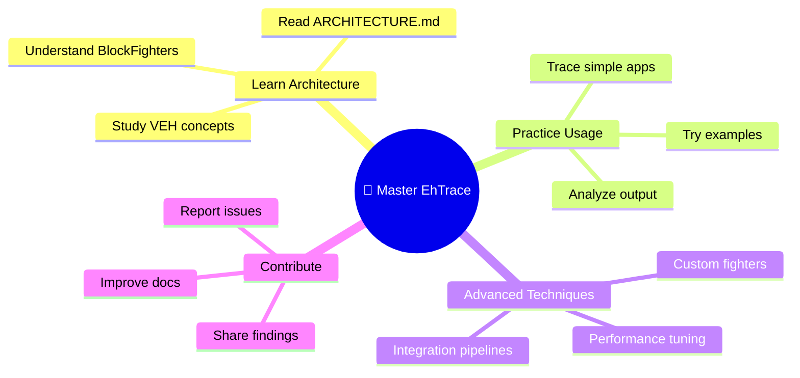

- 📚 Review [ARCHITECTURE.md](ARCHITECTURE.md) for technical details
- 📖 Explore example traces in the `doc/` directory
- ⚔️ Customize fighters for your specific use case
- 🔗 Integrate with your analysis pipeline

---

## 💬 Support

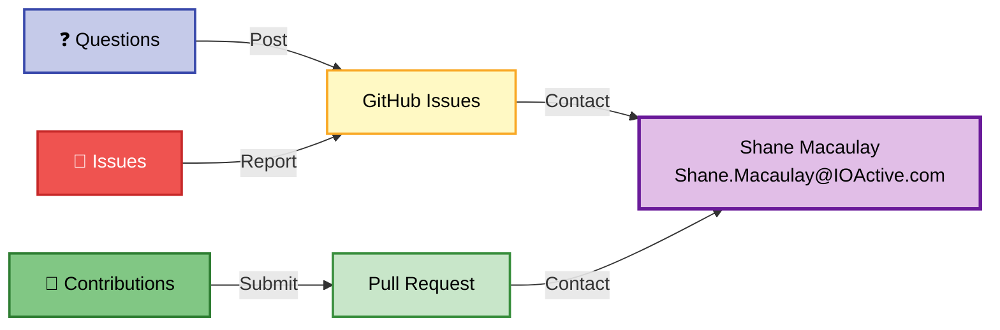

For issues, questions, or contributions:
- 🐛 **Open an issue** on GitHub
- 📧 **Contact**: Shane.Macaulay@IOActive.com
- 🤝 **Contribute**: Submit pull requests

---

> ⚡ **EhTrace**: Illuminating binary execution, one block at a time
