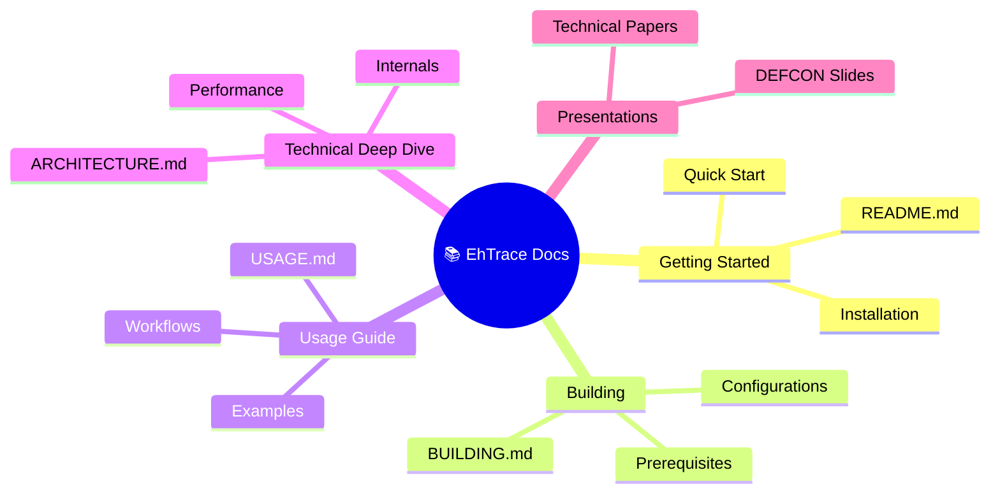
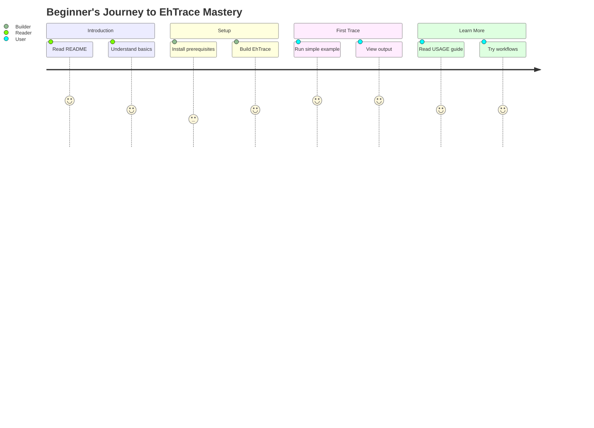
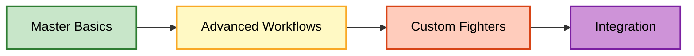
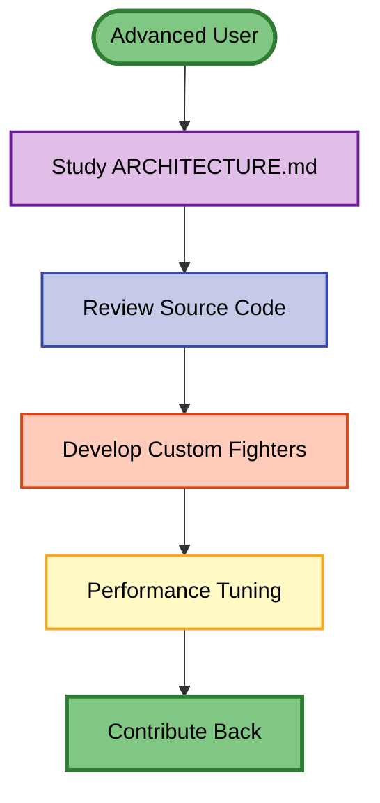
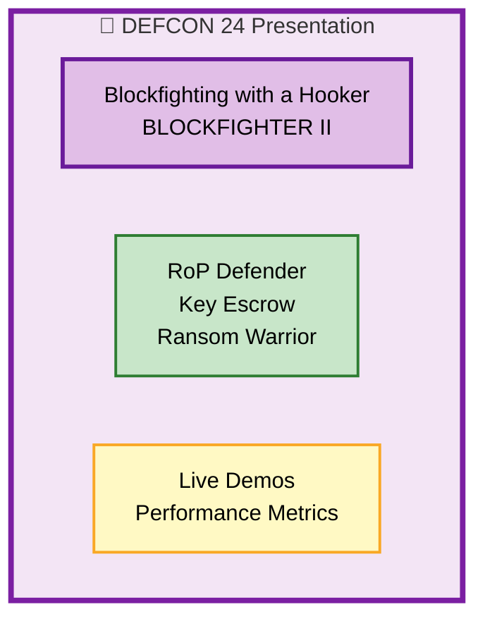
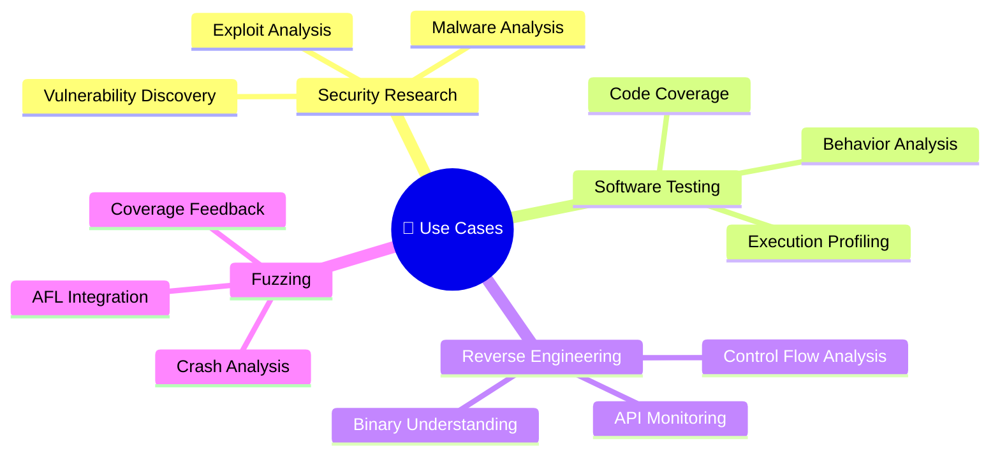
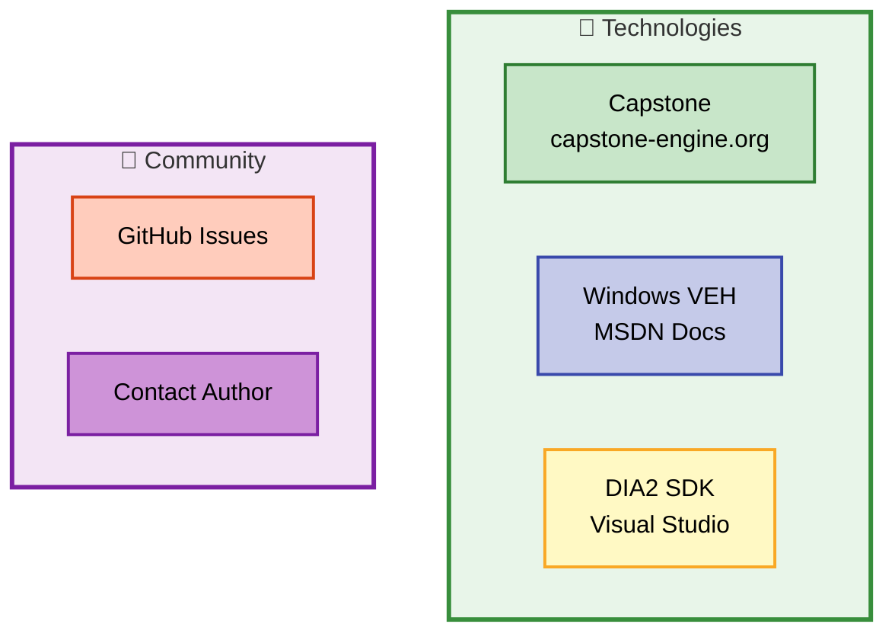
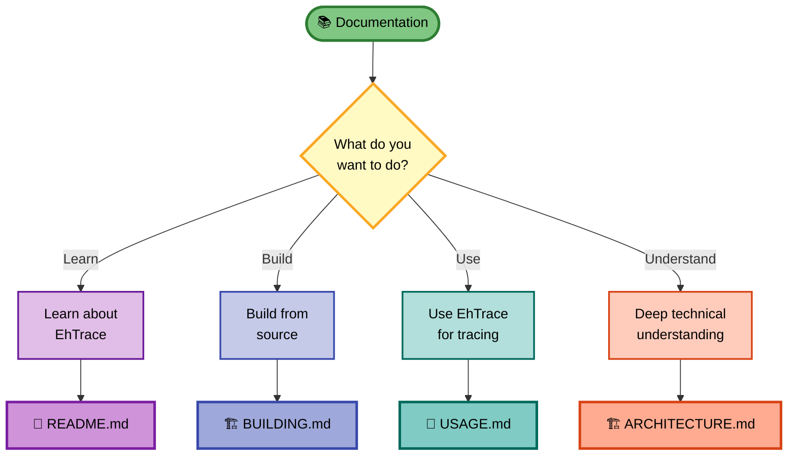

# 📚 EhTrace Documentation Index

> **Complete documentation resources for EhTrace binary tracing framework**

---

## 🎯 Documentation Structure



---

## 📖 Core Documentation

### 🏠 [README.md](../README.md)
**Main project overview and introduction**

Topics covered:
- ✅ Project overview and purpose
- ✅ Key features and capabilities
- ✅ Architecture overview with diagrams
- ✅ Performance benchmarks
- ✅ Component ecosystem
- ✅ Quick start guide
- ✅ License and contribution info

**Audience**: Everyone - start here!

---

### 🏗️ [BUILDING.md](../BUILDING.md)
**Complete build instructions and configurations**

Topics covered:
- ✅ Build prerequisites and tools
- ✅ Visual Studio setup
- ✅ MSBuild command-line builds
- ✅ Component-specific builds
- ✅ Configuration options
- ✅ Common build issues
- ✅ Advanced build scenarios

**Audience**: Developers building from source

---

### 🚀 [USAGE.md](../USAGE.md)
**Comprehensive usage guide with workflows**

Topics covered:
- ✅ Quick start examples
- ✅ DLL injection methods
- ✅ Trace collection
- ✅ Code coverage analysis
- ✅ Fuzzing integration (AWinAFL)
- ✅ RoP detection
- ✅ Key escrow
- ✅ Configuration options
- ✅ Analysis workflows
- ✅ Troubleshooting guide

**Audience**: Users instrumenting and analyzing binaries

---

### 🏗️ [ARCHITECTURE.md](../ARCHITECTURE.md)
**Technical architecture and implementation details**

Topics covered:
- ✅ System architecture diagrams
- ✅ Execution flow
- ✅ Component interactions
- ✅ Data structures
- ✅ BlockFighters framework
- ✅ Memory architecture
- ✅ Hook architecture
- ✅ Visualization pipeline
- ✅ Performance optimization
- ✅ Security considerations

**Audience**: Advanced users and contributors

---

## 🎓 Learning Paths

### 🟢 Beginner Path



**Step-by-step guide:**

1. **📖 Start with [README.md](../README.md)**
   - Understand what EhTrace is
   - Learn about key features
   - Review architecture overview

2. **🏗️ Follow [BUILDING.md](../BUILDING.md)**
   - Set up build environment
   - Build EhTrace DLL
   - Build supporting tools

3. **🚀 Practice with [USAGE.md](../USAGE.md)**
   - Try quick start example
   - Inject into simple program (notepad.exe)
   - Collect and view trace data

4. **🔄 Run first workflow**
   - Follow "Basic Code Coverage" workflow
   - Generate visualizations
   - Analyze results

---

### 🟡 Intermediate Path



**Recommended path:**

1. ✅ Complete beginner path
2. 📚 Study [USAGE.md](../USAGE.md) workflows in detail
3. ⚔️ Experiment with BlockFighters configuration
4. 🔍 Try vulnerability research workflow
5. 🐛 Set up AWinAFL fuzzing
6. 📊 Master visualization tools (WPFx, Agasm)

---

### 🔴 Advanced Path



**Deep dive path:**

1. 🏗️ Master [ARCHITECTURE.md](../ARCHITECTURE.md)
2. 💻 Study source code in depth
3. ⚔️ Implement custom BlockFighters
4. 🚀 Optimize for your use case
5. 🔧 Contribute improvements
6. 📝 Share findings and insights

---

## 🎪 Presentations & Research

### DEFCON 24 Presentation

**Location**: `doc/Blockfighting with a Hooker -- BLOCKFIGHTERII -- DC24.pptx`



**Topics covered:**
- 🛡️ RoP Defender - Call/Ret balance checking
- 🔑 Key Escrow - Cryptographic key interception
- 🛡️ Ransom Warrior - Ransomware defense
- ⚡ Performance demonstrations
- 📊 Real-world use cases

---

## 🔧 Component Reference

### Core Components

| Component | Purpose | Documentation |
|-----------|---------|---------------|
| **EhTrace.dll** | Main instrumentation DLL | [README](../README.md#components) |
| **Acleanout** | Log dumper | [USAGE](../USAGE.md#collecting-trace-data) |
| **Agasm** | Graph generator | [USAGE](../USAGE.md#analyzing-traces) |
| **Aload** | DLL injector | [USAGE](../USAGE.md#dll-injection-methods) |

### Analysis Tools

| Tool | Purpose | Documentation |
|------|---------|---------------|
| **WPFx** | Graph visualization | [README](../README.md#visualization) |
| **Dia2Sharp** | Symbol processing | [ARCHITECTURE](../ARCHITECTURE.md#component-architecture) |
| **AStackFolding** | Flame graph generation | [USAGE](../USAGE.md#workflow-4-performance-profiling) |

### Security Fighters

| Fighter | Purpose | Documentation |
|---------|---------|---------------|
| **RoP Defender** | RoP attack detection | [USAGE](../USAGE.md#rop-detection) |
| **Key Escrow** | Crypto key interception | [USAGE](../USAGE.md#key-escrow) |
| **AFL Fighter** | Fuzzing instrumentation | [USAGE](../USAGE.md#fuzzing-integration-awinafl) |

---

## 💡 Use Cases



### 🔒 Security Research

**Documentation**: [USAGE - Vulnerability Research Workflow](../USAGE.md#workflow-2-vulnerability-research)

Use EhTrace for:
- Finding memory corruption vulnerabilities
- Analyzing exploit effectiveness
- Understanding malware behavior
- Detecting RoP gadget chains

### 🧪 Software Testing

**Documentation**: [USAGE - Code Coverage Workflow](../USAGE.md#workflow-1-basic-code-coverage)

Use EhTrace for:
- Measuring code coverage
- Profiling performance hotspots
- Validating execution paths
- Regression testing

### 🔍 Reverse Engineering

**Documentation**: [ARCHITECTURE - Analysis Pipeline](../ARCHITECTURE.md#visualization-pipeline)

Use EhTrace for:
- Mapping control flow graphs
- Identifying key functions
- Understanding program behavior
- Symbol resolution and analysis

---

## 📚 Additional Resources

### External References



### Technology Documentation

- **Capstone**: [http://www.capstone-engine.org/](http://www.capstone-engine.org/)
- **MSAGL**: [Microsoft Research](https://www.microsoft.com/en-us/research/project/microsoft-automatic-graph-layout/)
- **DIA2**: [MSDN Documentation](https://docs.microsoft.com/en-us/visualstudio/debugger/debug-interface-access/)
- **VEH**: [Windows Documentation](https://docs.microsoft.com/en-us/windows/win32/debug/vectored-exception-handling)

### Community & Support

- **GitHub**: [https://github.com/K2/EhTrace](https://github.com/K2/EhTrace)
- **Issues**: Open issues for bugs or feature requests
- **Email**: Shane.Macaulay@IOActive.com

---

## 🗺️ Documentation Map



---

## 📝 Quick Reference

### Essential Commands

```bash
# Build
msbuild EhTrace.sln /p:Configuration=Release /p:Platform=x64

# Inject
Aload.exe target.exe EhTrace.dll

# Collect
Acleanout.exe > trace.log

# Visualize
WPFx.exe trace.log
```

### File Locations

```
EhTrace/
├── README.md              # Project overview
├── BUILDING.md            # Build guide
├── USAGE.md               # Usage guide
├── ARCHITECTURE.md        # Technical details
├── doc/                   # Additional documentation
│   ├── README.md          # This file
│   └── *.pptx             # Presentations
├── EhTrace/               # Core DLL source
├── prep/                  # Supporting tools
└── vis/                   # Visualization tools
```

---

> 🎯 **EhTrace Documentation**: Your guide to mastering high-performance binary tracing

**Last Updated**: 2024  
**Maintained by**: Shane Macaulay (Shane.Macaulay@IOActive.com)
